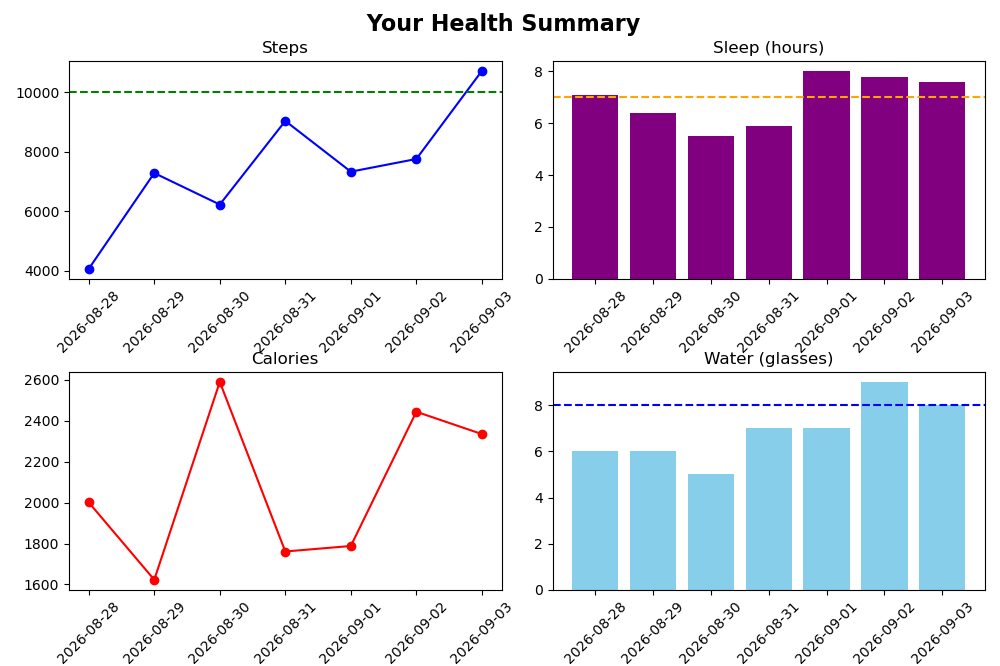

# HealthTrack Pro

**A Python-based health data tracking and analytics application for monitoring daily wellness patterns through data analysis and visualization.**

HealthTrack Pro is a personal health-data application developed with Python to collect, store, analyze, and visualize daily wellness measurements. Users can record their **steps, calories burned, sleep duration, and water intake**, then explore trends and receive simple rule-based feedback based on their recorded data.

The project combines programming, data analysis, visualization, and basic health analytics into a practical application.

---

## Project Overview



Health data is increasingly collected through smartphones, wearable devices, and digital health platforms. However, collecting data is only the first step; meaningful insights require the ability to organize, analyze, and communicate that information effectively.

HealthTrack Pro was developed as a practical exploration of this process.

The application allows users to:

* Record daily wellness measurements
* Store and retrieve historical records using CSV files
* Calculate summary statistics
* Identify patterns in their daily habits
* Visualize changes over time
* Compare measurements with predefined wellness targets
* Receive simple, rule-based recommendations

The project demonstrates how **Python and data analytics can be applied to a health-related problem**.

---

## Key Features

### Data Collection

Users can record four daily metrics:

| Metric   | Description                          |
| -------- | ------------------------------------ |
| Steps    | Number of steps taken during the day |
| Calories | Estimated calories burned            |
| Sleep    | Hours of sleep                       |
| Water    | Number of glasses of water consumed  |

The application validates user input before storing the data.

### Data Persistence

Health records are stored in CSV files, allowing information to remain available between sessions.

The application supports:

* Adding new records
* Loading existing records
* Generating sample datasets for testing
* Clearing stored data

### Data Analysis

Pandas is used to process the collected data and calculate summary statistics, including average:

* Daily steps
* Calories burned
* Sleep duration
* Water consumption

### Visualization

Matplotlib is used to transform numerical health records into visual trends.

The application generates charts that allow users to observe changes in their measurements over time and compare their activity with predefined targets.

### Personalized Feedback

The application provides simple rule-based recommendations based on the user's recorded measurements.

For example, the system can identify when average sleep or water consumption falls below a predefined target and provide a corresponding suggestion.

> **Note:** The recommendations are intended for general wellness tracking and are not medical advice or a clinical decision-support system.

---

## Technology Stack

| Technology     | Role                                       |
| -------------- | ------------------------------------------ |
| **Python**     | Core application development               |
| **Pandas**     | Data manipulation and statistical analysis |
| **Matplotlib** | Data visualization                         |
| **CSV**        | Data storage and persistence               |
| **datetime**   | Date handling                              |
| **random**     | Sample data generation                     |
| **Git/GitHub** | Version control and project management     |

---

## Data Structure

Each health record contains the following fields:

| Field      | Type    | Description                         |
| ---------- | ------- | ----------------------------------- |
| `date`     | Date    | Date of the recorded measurement    |
| `steps`    | Integer | Daily step count                    |
| `calories` | Float | Estimated calories burned           |
| `sleep`    | Integer  | Sleep duration in hours             |
| `water`    | Integer | Number of glasses of water consumed |

Example:

```text
date        steps   calories   sleep   water
2026-08-01  8234    2150       7.5     8
2026-08-02  6742    1980       6.8     6
2026-08-03  9121    2310       8.0     9
```

---

## Application Workflow

The application follows a simple data pipeline:

```text
User Input
    ↓
Input Validation
    ↓
CSV Data Storage
    ↓
Pandas Data Processing
    ↓
Statistical Analysis
    ↓
Visualization
    ↓
Rule-Based Health Insights
```

This workflow reflects a basic real-world data analytics process: **collect → store → process → analyze → communicate**.

---

## Getting Started

### Requirements

* Python 3.6+
* pip
* Pandas
* Matplotlib

### Installation

Clone the repository:

```bash
git clone https://github.com/yourusername/health-dashboard-python.git
cd health-dashboard-python
```

Install the required packages:

```bash
pip install pandas matplotlib
```

### Run the application

```bash
python health_dashboard.py
```
---

## Project code
[View Code Here](health_dashboard.py)

---

## Using HealthTrack Pro

When the application starts, users can choose to:

1. Start entering your own data
2. Generate sample data to test
3. Exit

After data has been added, the main menu provides options to:

* View Dashboard
* Add Today's Entry
* Generate Sample Data (for testing)
* Clear All data
* Exit

The dashboard summarizes the available records and generates visualizations to help users understand their patterns.

---

## Example Output

```text
HEALTH TRACK PRO
────────────────────────────────

Records analysed: 30

Average daily steps:       7,234
Average calories burned:   2,100
Average sleep:             6.8 hours
Average water intake:      7.2 glasses

INSIGHTS
────────────────────────────────
✓ Activity level is close to the target.
→ Consider improving sleep consistency.
→ Water intake could be increased.

Generating visualizations...
```

---

## What I Learned

Developing HealthTrack Pro provided practical experience with several stages of a data project.

### Python Programming

I applied functions, loops, conditional logic, exception handling, file operations, and user input handling to build an interactive application.

### Data Analysis

I used Pandas to structure health records and perform calculations on multiple health-related variables.

### Data Visualization

I used Matplotlib to convert numerical measurements into visual trends, making the data easier to interpret.

### Data Management

Working with CSV files provided practical experience with storing, loading, updating, and clearing structured datasets.

### Health Data Thinking

The project also introduced an important aspect of health informatics: **turning routinely collected measurements into information that can support better understanding of health-related behaviour.**

---

## Limitations

HealthTrack Pro is an educational and personal wellness-tracking project.

The current version:

* Uses manually entered data
* Stores information locally in CSV files
* Uses predefined thresholds for recommendations
* Does not connect to wearable devices
* Does not perform clinical risk prediction
* Does not provide medical diagnosis

These limitations provide opportunities for future development while keeping the current application simple and transparent.

---

## Future Directions

Possible extensions include:

* Integration with wearable-device APIs
* User-defined health goals
* Weekly and monthly comparisons
* More advanced statistical analysis
* Automated anomaly detection
* Interactive web interface using Streamlit
* Database-based storage
* Machine-learning models for personalized pattern analysis

These extensions would move the project from a simple personal tracking application toward a more comprehensive **health-data analytics platform**.

---

## Why This Project Matters

HealthTrack Pro represents my interest in the intersection of **healthcare, data, and computational methods**.

Rather than treating health data as isolated measurements, the project explores how computational tools can be used to collect, organize, analyze, and communicate health-related information.

It is a small project, but it reflects a broader interest in developing the technical skills required to work with increasingly data-driven healthcare systems.

---

## License

This project is licensed under the MIT License. See the [`LICENSE`](LICENSE) file for details.

---

## Author

**Chidera John**

Medical Laboratory Science student interested in **health data science, computational biology, and the application of Artificial Intelligence to healthcare.**

---

**Built with Python • Pandas • Matplotlib • Data Analytics**
